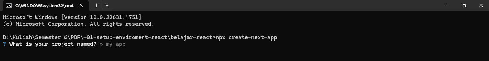
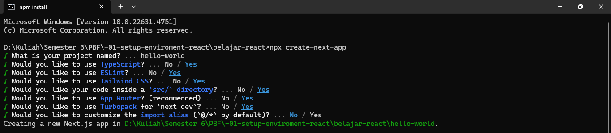
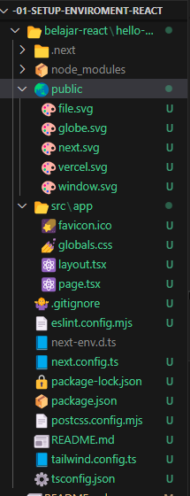
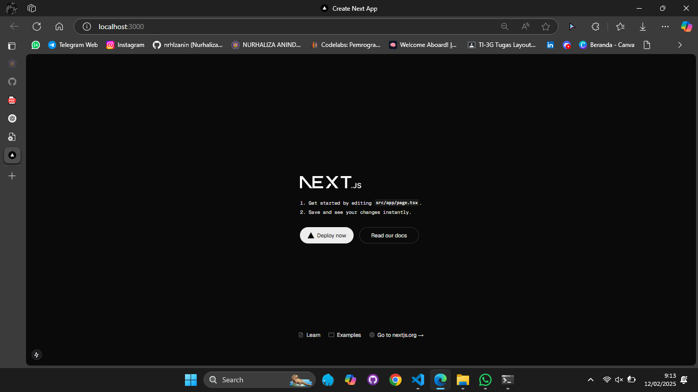
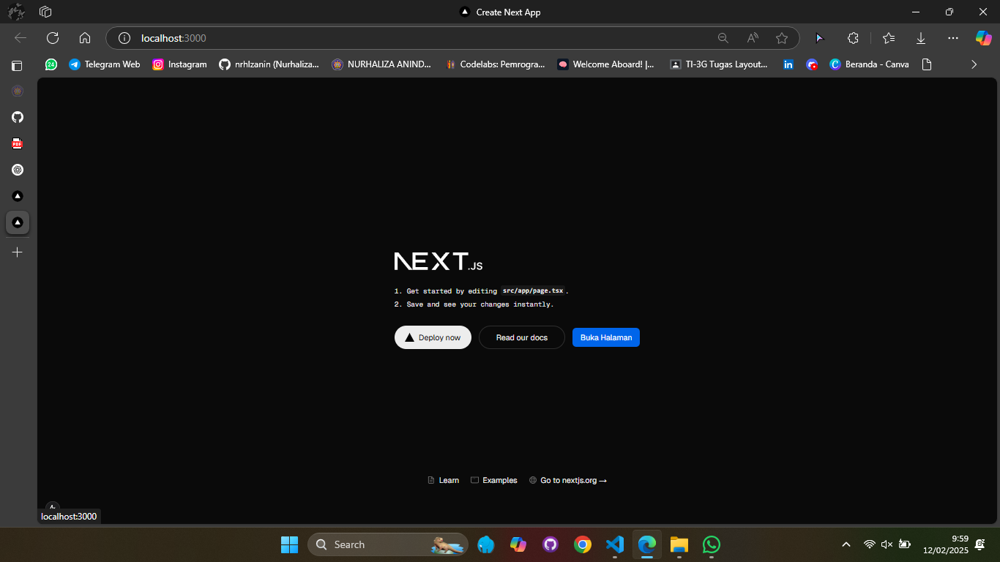
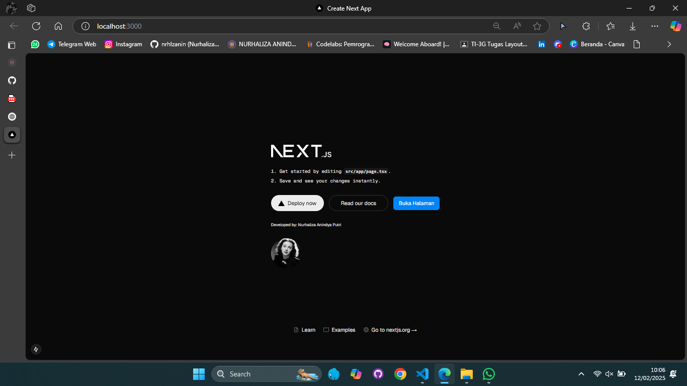

This is a [Next.js](https://nextjs.org/) project bootstrapped with [`create-next-app`](https://github.com/vercel/next.js/tree/canary/packages/create-next-app).

## Getting Started

First, run the development server:

```bash
npm run dev
# or
yarn dev
# or
pnpm dev
# or
bun dev
```

Open [http://localhost:3000](http://localhost:3000) with your browser to see the result.

You can start editing the page by modifying `app/page.tsx`. The page auto-updates as you edit the file.

This project uses [`next/font`](https://nextjs.org/docs/basic-features/font-optimization) to automatically optimize and load Inter, a custom Google Font.

## Laporan Praktikum

|  | Pemrograman Berbasis Framework 2025 |
|--|--|
| NIM |  2241720016|
| Nama |  Nurhaliza Anindya Putri |
| Kelas | TI - 3D |


## Praktikum 1: Menyiapkan Lingkungan Pengembangan 
### Pertanyaan dan Jawaban Praktikum 1 

1. Jelaskan kegunaan masing-masing dari Git, VS Code dan NodeJS yang telah Anda install 
pada sesi praktikum ini! 

> - Git digunakan sebagai sistem kontrol proyek yang membantu dalam mengelola perubaan kode secara efisien, memungkinkan kolaborasi dengan tim, serta menyimpan riwayat pengembangan proyek.
> - VS Code digunakan sebagai editor kode yang mendukung berbagai bahasa pemrograman, serta memiliki ekstensi untuk memudahkan pengembang membuat sebuah aplikasi.
> - NodeJS digunakan untuk membangun aplikasi backend serta mengelola depedensi proyek dengan npm (Node Package Manager).

2. Buktikan dengan screenshoot yang menunjukkan bahwa masing-masing tools tersebut 
telah berhasil terinstall di perangkat Anda!

> Bukti setup environment telah berhasil di  komputer.
> - setup environment github
> 
> - setup environment VS Code
> 
> - setup environment NodeJS 
> 

## Praktikum 2: Membuat Proyek Pertama React Menggunakan Next.js 
1. Membuat folder proyek baru dengan nama ```bash belajar-react ```. Melalui konsol/command 
prompt/CMD masuk ke dalam folder tersebut dan jalankan perintah ini: 
```bash npx create-next-app ``` 

> 

2. Buat proyek baru dengan nama hello-world seperti di bawah ini. Nama proyek ini perlu 
dimasukkan pertama kali melalui konsol. 

> 

3. Buka folder proyek hello-world menggunakan VS Code. Masuk ke dalam folder proyek hello
world dengan perintah: 
```bash cd hello-world ```
Kemudian setelah masuk ke folder hello-world, masukkan perintah: 
```bash code . ```
Maka VS Code akan membuka project react Anda yang telah dibuat bernama ```bash hello-world. ```
Dan akan menampilkan struktur folder proyek seperti di bawah ini. 

> 

4. Running proyek hello-world dengan memasukkan perintah di bawah ini melalui konsol atau 
terminal di dalam VS Code. 
```bash npm run dev ```
Tunggu proses kompilasi hingga selesai. Lalu Anda dapat membuka alamat localhost di 
browser: http://localhost:3000/ 
 
Jika di browser telah tampil seperti gambar berikut ini, Selamat!

> 

### Pertanyaan dan Jawaban Praktikum 2
1. Pada Langkah ke-2, setelah membuat proyek baru menggunakan Next.js, terdapat beberapa istilah yang muncul. Jelaskan istilah tersebut, TypeScript, ESLint, Tailwind CSS, App Router, Import alias, App router, dan Turbopack! 

> - TypeScript adalah superset dari JavaScript yang menambahkan typing (tipe data) pada variabel dan fungsi.
> ESLint adalah linter untuk JavaScript dan TypeScript yang membantu menjaga konsistensi kode dengan mendeteksi dan memperbaiki kesalahan sintaks atau praktik buruk dalam coding.
> - Tailwind CSS adalah framework CSS berbasis utility-first yang memungkinkan kita menulis kode CSS langsung di atribut class tanpa perlu membuat file CSS terpisah.
> - App Router adalah sistem routing baru di Next.js yang menggunakan folder app/ sebagai root proyek, menggantikan pages/ dari Page Router. 
> - Import alias memungkinkan untuk mengakses file atau folder dengan path yang lebih pendek.
> - Turbopack adalah bundler baru di Next.js yang lebih cepat dibandingkan Webpack dan digunakan untuk mempercepat hot module replacement (HMR) saat pengembangan.

2. Apa saja kegunaan folder dan file yang ada pada struktur proyek react yang tampil pada gambar pada tahap percobaan ke-3! 

> 
> 
> Struktur Proyek React (Next.js)
>
> Folder Utama
> - **`_next/`** → Folder otomatis dari Next.js untuk hasil build & caching.
> - **`node_modules/`** → Berisi library yang diinstal dengan `npm install`.
> - **`public/`** → Menyimpan file statis seperti gambar, ikon, dan aset lainnya.
> - **`src/app/`** → Folder utama proyek, berisi:
>   - **`page.tsx`** → Halaman utama aplikasi.
>   - **`layout.tsx`** → Struktur layout global (header, footer, dll.).
>   - **`globals.css`** → File styling global untuk seluruh aplikasi.
>
> File Konfigurasi Penting
> - **`.gitignore`** → Mengecualikan file tertentu dari Git.
> - **`eslint.config.mjs`** → Menjaga kualitas kode dengan ESLint.
> - **`next.config.ts`** → Pengaturan alias, optimasi gambar, dll.
> - **`package.json` & `package-lock.json`** → Informasi proyek & daftar dependensi.
> - **`postcss.config.ts`** → Konfigurasi untuk PostCSS.
> - **`tailwind.config.ts`** → Pengaturan Tailwind CSS.
> - **`tsconfig.json`** → Konfigurasi TypeScript.
>
> Kesimpulan
> - **`app/`** → Inti proyek Next.js (berisi halaman & layout).
> - **`public/`** → Menyimpan aset statis.
> - **File konfigurasi** → Mengatur proyek agar berjalan optimal.

3. Buktikan dengan screenshoot yang menunjukkan bahwa tahapan percobaan di atas telah 
berhasil Anda lakukan!

> 

## Praktikum 3: Menambahkan Komponen React (Button) 
### Pertanyaan dan Jawaban Praktikum 3
1. Buktikan dengan screenshoot yang menunjukkan bahwa tahapan percobaan di atas telah 
berhasil Anda lakukan! 

> 

## Praktikum 4: Menulis Markup dengan JSX 
### Pertanyaan dan Jawaban Praktikum 4 
1. Untuk apakah kegunaan sintaks user.imageUrl?

> Sintaks user.imageUrl digunakan untuk mengambil URL gambar dari objek user. Dalam contoh kode, user.imageUrl adalah URL gambar profil yang akan ditampilkan dalam tag  di dalam komponen Profile.

2. Buktikan dengan screenshoot yang menunjukkan bahwa tahapan percobaan di atas telah 
berhasil Anda lakukan! 

> 

