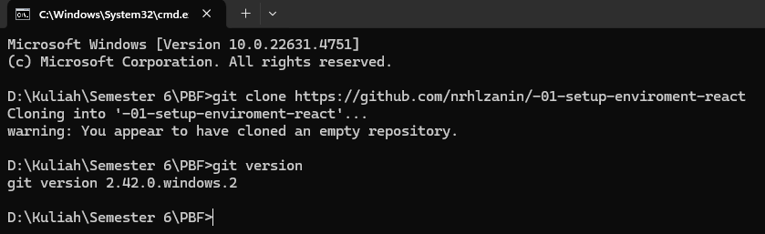
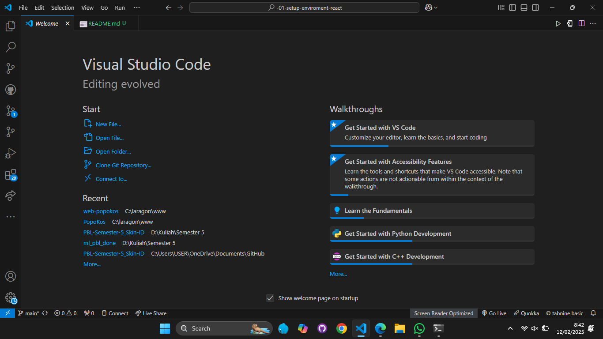
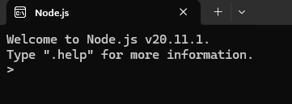

This is a [Next.js](https://nextjs.org/) project bootstrapped with [`create-next-app`](https://github.com/vercel/next.js/tree/canary/packages/create-next-app).

## Getting Started

First, run the development server:

```bash
npm run dev
# or
yarn dev
# or
pnpm dev
# or
bun dev
```

Open [http://localhost:3000](http://localhost:3000) with your browser to see the result.

You can start editing the page by modifying `app/page.tsx`. The page auto-updates as you edit the file.

This project uses [`next/font`](https://nextjs.org/docs/basic-features/font-optimization) to automatically optimize and load Inter, a custom Google Font.

## Laporan Praktikum

|  | Pemrograman Berbasis Framework 2025 |
|--|--|
| NIM |  2241720016|
| Nama |  Nurhaliza Anindya Putri |
| Kelas | TI - 3D |


### Pertanyaan Praktikum 1 
1. Jelaskan kegunaan masing-masing dari Git, VS Code dan NodeJS yang telah Anda install 
pada sesi praktikum ini! 

> - Git digunakan sebagai sistem kontrol proyek yang membantu dalam mengelola perubaan kode secara efisien, memungkinkan kolaborasi dengan tim, serta menyimpan riwayat pengembangan proyek.
> - VS Code digunakan sebagai editor kode yang mendukung berbagai bahasa pemrograman, serta memiliki ekstensi untuk memudahkan pengembang membuat sebuah aplikasi.
> - NodeJS digunakan untuk membangun aplikasi backend serta mengelola depedensi proyek dengan npm (Node Package Manager).

2. Buktikan dengan screenshoot yang menunjukkan bahwa masing-masing tools tersebut 
telah berhasil terinstall di perangkat Anda!

> Bukti setup environment telah berhasil di  komputer.
> - setup environment github
> 
> - setup environment VS Code
> 
> - setup environment NodeJS 
> 

> Berdasarkan screenshot di atas, setup environment telah berhasil dilakukan di laptop saya.